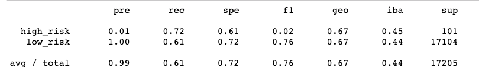
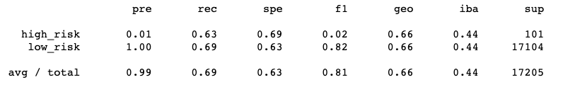
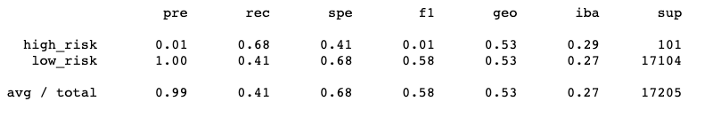
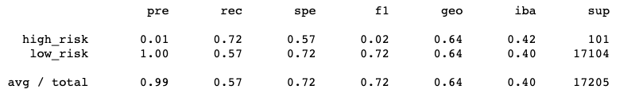
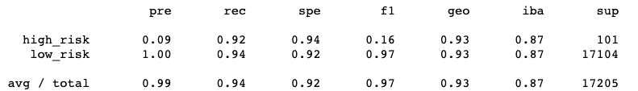

# Credit_Risk_Analysis

The purpose of this analysis is to assess the best way to sample data for a machine learning model that predicts the risk of credit loans to certain borrowers. Among the many metrics used to assess risk, a few notable ones were home ownership status (rent, mortgage, owner), deliquency on previous loans, annual income, and loan amount.

## Results

### Naive Random Oversampling

- The precision for high risk loans is extremely low while the precision for low risk loans is a perfect 100%. This model is highly effective at predicting true positive low risk loans but is likely to have many false positives for high risk loans. 
- The recall indicates that this model is just above average at correctly predicting high risk and low risk loans. In other words, these recall numbers indicate that this model only predicts correctly 72% of the time for high risk loans and 61% of the time for low risk loans.
- The balanced accuracy score for is the average recall of each class (low risk and high risk), which is 66.79%. This model is 66.79% accurate at making predictions.

### SMOTE Oversampling

- The precision for high risk loans is extremely low while the precision for low risk loans is a perfect 100%. This model is highly effective at predicting true positive low risk loans but is likely to have many false positives for high risk loans. 
- The recall indicates that this model can predict 63% of high risk loans correctly and 69% of low risk loans correctly. 
- The balanced accuracy score is 66.22%, which means that this model is 66.22% likely to predict the correct loan risk category.

### Undersampling

- The precision for high risk loans is extremely low while the precision for low risk loans is a perfect 100%. This model is highly effective at predicting true positive low risk loans but is likely to have many false positives for high risk loans. 
- The recall score indicates that this model can correctly predict high risk loans 68% of the time and low risk loans 41% of the time.
- The balanced accuracy score is 54.7%, which means that this model can correctly predict the loan status about 55% of the time.

### Combination (SMOTEEN)

- The precision for high risk loans is extremely low while the precision for low risk loans is a perfect 100%. This model is highly effective at predicting true positive low risk loans but is likely to have many false positives for high risk loans. 
- The recall score indicates that this model can correctly predict high risk loans 72% of the time and low risk loans 57% of the time.
- The balanced accuracy score is 64.47%, meaning that this model can make correct predictions about 64.47% of the time. 

### Balanced Random Forest Classifier

- The precision for high risk loans is extremely low while the precision for low risk loans is a perfect 100%. This model is highly effective at predicting true positive low risk loans but is likely to have many false positives for high risk loans. 
- The recall score indicates that this model can correctly predict high risk loans 68% of the time and can predict low risk loans 89% of the time.
- The balanced accuracy score is 78.57%, meaning this make correct predictions about 79% of the time.

### Easy Ensemble Classifier

- The precision for high risk loans is still extremely low while the precision for low risk loans is a perfect 100%. This model is highly effective at predicting true positive low risk loans but is likely to have many false positives for high risk loans. 
- The recall indicates that this model can correctly predict 92% of high risk loans and 94% of low risk loans.
- The balanced accuracy score is 93.29%, meaning that this model's predictions are 93% accurate. 

## Summary

All of these models are highly effective at predicting low risk loans, but are not effective at predicting high risk loans. The model using the easy ensemble classifier has the highest recall, balanced accuracy score, and highest precision for high risk loans, but is still dismal at predicting high risk loans at 9%. This means that even though the easy ensemble classifier is 93% accurate, the positive classification of high risk loans is only reliable 9% of the time. This could lead to a large number high risk loans being falsely classified as low risk loans.
